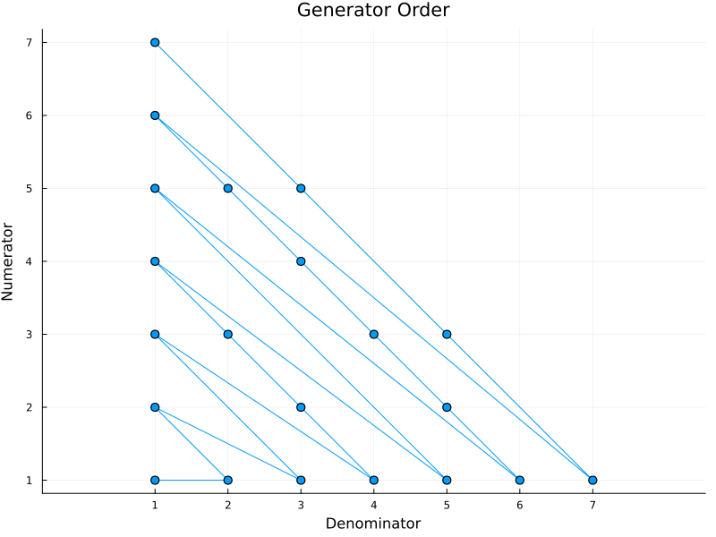

# `RationalGenerators`

This module provides iterators for creating positive rational numbers 
without repetition.

* Use `RationalGenerator(n)` to create all rational numbers of the form `a//b` 
where `a` and `b` are relatively prime and `a+b ≤ n`. 
* Use `RationalGenerator()` to create *all* rational numbers. 


## Order

The first rational number produced is `1//1`. Then `1//2` and `2//1`. Then, for `n` equal to `4` and up, we have, in increasing order, 
the rational numbers of the form `a//b` where `a+b = n` and `gcd(a,b) = 1`. 

This figure illustrates the order in which rational numbers are generated:



## Examples

```
julia> using RationalGenerators

julia> collect(RationalGenerator(5))'
1×9 adjoint(::Vector{Rational{Int64}}) with eltype Rational{Int64}:
 1//1  1//2  2//1  1//3  3//1  1//4  2//3  3//2  4//1

julia> [r for r in RationalGenerator(7) if r < 1]'
1×8 adjoint(::Vector{Rational{Int64}}) with eltype Rational{Int64}:
 1//2  1//3  1//4  2//3  1//5  1//6  2//5  3//4

julia> sum(RationalGenerator(9))
8899//168

julia> for r in RationalGenerator()
            if r > 8//3
                println(r)
                break
            end
        end
3//1

julia> [t for t in RationalGenerator(20) if denominator(t) == 10]
4-element Vector{Rational{Int64}}:
 1//10
 3//10
 7//10
 9//10
```